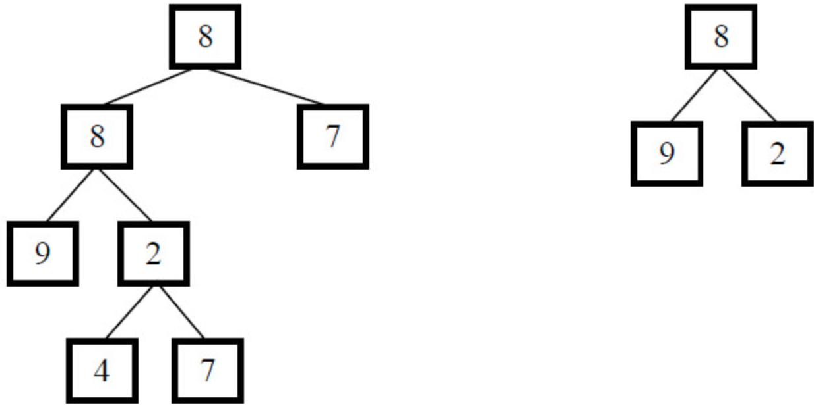

# JZ26 树的子结构

## 描述

输入两棵二叉树A，B，判断B是不是A的子结构。（我们约定空树不是任意一个树的子结构）

<!--more--> 

假如给定A为{8,8,7,9,2,#,#,#,#,4,7}，B为{8,9,2}，2个树的结构如下，可以看出B是A的子结构



数据范围: 

- $0 <= A的节点个数 <= 10000$  

- $0 <= B的节点个数 <= 10000$

**示例1**

```
输入：{8,8,7,9,2,#,#,#,#,4,7},{8,9,2}
返回值：true
```

**示例2**

```
输入：{1,2,3,4,5},{2,4}
返回值：true
```

**示例3**

```
输入：{1,2,3},{3,1}
返回值：false
```

## 题解

初见思路：子结构的话应该是用递归，可以层序遍历A树，找到B树的根，然后开始递归比较。

思路没什么问题，但是实现的时候~~犯了病~~，想要首先找到A树中和B树的根相同的节点，然后再双指针同时遍历对比，但是第一是写的有些条件没处理好，二是没有考虑到可能有多个节点在A中和B的根相同。

这个递归的边界条件也非常多，需要考虑不少。~~有问题还得问大G老师阿~~

**代码**

```C++
/*
struct TreeNode {
    int val;
    struct TreeNode *left;
    struct TreeNode *right;
    TreeNode(int x) :
            val(x), left(NULL), right(NULL) {
    }
};*/
class Solution {
public:
    bool HasSubtree(TreeNode* pRoot1, TreeNode* pRoot2) {
        if (!pRoot1 || !pRoot2) return false;

        // 当前节点匹配 或 左子树匹配 或 右子树匹配
        return isSubtree(pRoot1, pRoot2) 
            || HasSubtree(pRoot1->left, pRoot2) 
            || HasSubtree(pRoot1->right, pRoot2);
    }

    bool isSubtree(TreeNode* r1, TreeNode* r2) {
        if (!r2) return true;   // pRoot2 遍历完，说明匹配成功
        if (!r1) return false;  // pRoot1 先遍历完，失败
        if (r1->val != r2->val) return false;

        // 继续比较左右子树
        return isSubtree(r1->left, r2->left) && isSubtree(r1->right, r2->right);
    }
};


```

