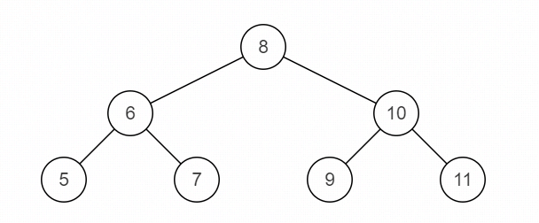
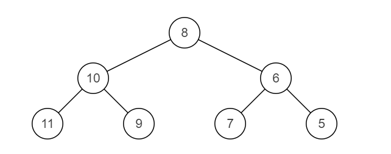

# JZ27 二叉树的镜像

## 描述

操作给定的二叉树，将其变换为源二叉树的镜像。 

<!--more-->

数据范围：二叉树的节点数 $0≤n≤1000$ ， 二叉树每个节点的值 $0≤val≤1000$  

要求： 空间复杂度 $O(n)$ 。本题也有原地操作，即空间复杂度 $O(1)$ 的解法，时间复杂度 $O(n)$   

比如： 

源二叉树



镜像二叉树



**示例1**

```
输入：{8,6,10,5,7,9,11}
返回值：{8,10,6,11,9,7,5}
说明：如题面所示    
```

**示例2**

```
输入：{}
返回值：{}
```

## 题解

初见思路：感觉这道题如果使用递归来做的话，就是直接递归把每一个节点的左右子树都反转就可以了，如果原地来做的话是使用栈来做吗？层序遍历每一层，然后把它们对调，试一试吧。~~（一遍过）~~

找大G老师分析了一下，使用栈方法也是$O(n)$的空间复杂度，原地的方法竟然是递归！！！
看了下官方题解也说是递归，但是递归栈也是要空间的阿，感觉牛客这个题有点整蛊了。

**代码**

```C++
 /**
 * struct TreeNode {
 *	int val;
 *	struct TreeNode *left;
 *	struct TreeNode *right;
 *	TreeNode(int x) : val(x), left(nullptr), right(nullptr) {}
 * };
 */
#include <stack>
class Solution {
public:
    /**
     * 代码中的类名、方法名、参数名已经指定，请勿修改，直接返回方法规定的值即可
     *
     * 
     * @param pRoot TreeNode类 
     * @return TreeNode类
     */
    TreeNode* Mirror(TreeNode* pRoot) {
        if(!pRoot) return nullptr;

        stack<TreeNode*> st;
        st.push(pRoot);
        while (!st.empty()) {
            TreeNode* curr = st.top();
            st.pop();
            TreeNode* temp = curr->left;
            curr->left = curr->right;
            curr->right = temp;
            
            if(curr->left) st.push(curr->left);
            if(curr->right) st.push(curr->right);
        }

        return pRoot;
    }
};
```
