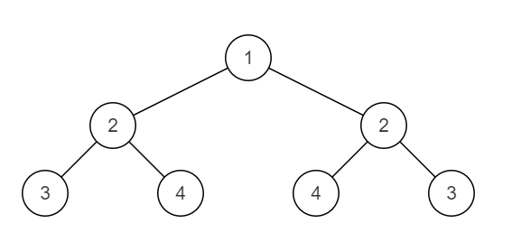
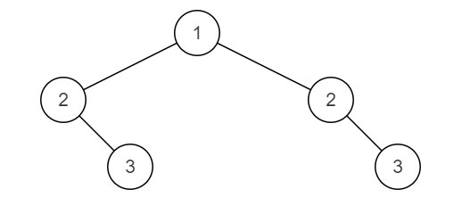

# JZ28 对称的二叉树

## 描述

给定一棵二叉树，判断其是否是自身的镜像（即：是否对称）

<!--more-->

例如：                 下面这棵二叉树是对称的



下面这棵二叉树不对称。



数据范围：节点数满足 $0≤n≤1000$，节点上的值满足 $∣val∣≤1000$  

要求：空间复杂度 $O(n)$，时间复杂度 $O(n)$  

备注：你可以用递归和迭代两种方法解决这个问题

**示例1**

```
输入：{1,2,2,3,4,4,3}
返回值：true
```

**示例2**

```
输入：{8,6,9,5,7,7,5}
返回值：false
```

## 题解

初见思路：看到这道题就想到了[JZ27二叉树的镜像](JZ27_二叉树的镜像.md)，当时的实现方式是用队列做层序遍历，然后层序遍历的时候检查每一层是否镜像对称，但是考虑图2的情况，层序遍历好像不好用。~~这题为什么是简单？？~~

问了大G老师写的，递归写法重点在于往下递归的时候是$leftRoot->left$和$rightRoot->right$比较。

```C++
/**
 * struct TreeNode {
 *  int val;
 *  struct TreeNode *left;
 *  struct TreeNode *right;
 *  TreeNode(int x) : val(x), left(nullptr), right(nullptr) {}
 * };
 */
class Solution {
  public:
    /**
     * 代码中的类名、方法名、参数名已经指定，请勿修改，直接返回方法规定的值即可
     *
     *
     * @param pRoot TreeNode类
     * @return bool布尔型
     */
    bool isSymmetrical(TreeNode* pRoot) {
        if (!pRoot) return true;

        return isMirror(pRoot->left, pRoot->right);

    }
  private:

    bool isMirror(TreeNode* leftRoot, TreeNode* rightRoot) {
        if (!leftRoot && !rightRoot) return true;

        if (!leftRoot || !rightRoot) return false;

        return (leftRoot->val == rightRoot->val) &&
               isMirror(leftRoot->left, rightRoot->right) &&
               isMirror(leftRoot->right, rightRoot->left);
    }
};
```


