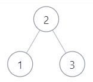

# JZ33 二叉搜索树的后序遍历序列

## 描述

输入一个整数数组，判断该数组是不是某二叉搜索树的后序遍历的结果。如果是则返回 true ,否则返回 false 。假设输入的数组的任意两个数字都互不相同。 

<!--more-->

数据范围： 节点数量 $0≤n≤1000$ ，节点上的值满足 $1≤val≤105$ ，保证节点上的值各不相同
要求：空间复杂度 $O(n)$ ，时间时间复杂度 $O(n^2)$
提示：
1.二叉搜索树是指父亲节点大于左子树中的全部节点，但是小于右子树中的全部节点的树。
2.该题我们约定空树不是二叉搜索树
3.后序遍历是指按照 “左子树-右子树-根节点” 的顺序遍历
4.参考下面的二叉搜索树，示例 1 



**示例1**

```
输入：[1,3,2]
返回值：true
说明：是上图的后序遍历 ，返回true        
```

**示例2**

```
输入：[3,1,2]
返回值：false
说明：不属于上图的后序遍历，从另外的二叉搜索树也不能后序遍历出该序列 ，因为最后的2一定是根节点，前面一定是孩子节点，可能是左孩子，右孩子，根节点，也可能是全左孩子，根节点，也可能是全右孩子，根节点，但是[3,1,2]的组合都不能满足这些情况，故返回false   
```

**示例3**

```
输入：[5,7,6,9,11,10,8]
返回值：true
```

## 题解

初见思路：首先要想明白二叉搜索树的后序遍历有什么特点，最后一个一定是根节点，然后根据**示例2**我们可以想到一定能够找到一个位置，使得左侧的全部小于它，右侧的全部大于它。由此这就变成了一个数组问题，从最右侧找一个值，然后开始从左侧遍历，直到找到一个比它大的，记住这个位置，以此划分左右子树，从这里开始向右遍历，若是找到比它小的，则返回$false$，认定非法，若直到最后也找不到，则递归左右子树。

这道题目的坑在于空子树不算二叉搜索树，但是子树中的空子树我们应当视为二叉搜索树，在递归时需要注意。

**代码**

```C++
#include <vector>
#include <iostream>
using namespace std;
class Solution {
public:
    bool VerifySquenceOfBST(vector<int> sequence) {
        if(sequence.empty()) return false;
        int length = sequence.size();
        if(length == 1) return true;        
        int root = sequence[length-1];


        int index = 0;
        for(; index < length-1; index++){
            if(sequence[index]>root) break;
        }

        int seperate = index;
        for(;index<length-1;index++){
            if (sequence[index]<root) {
                return false;
            }
        }

        vector<int> leftSeq;
        for(int i = 0; i < seperate; i++)   leftSeq.push_back(sequence[i]);
        vector<int> rightSeq;
        for(int i = seperate; i < length-1; i++)   rightSeq.push_back(sequence[i]);

        if (leftSeq.empty()) {
            return VerifySquenceOfBST(rightSeq);
        }else if (rightSeq.empty()) {
            return VerifySquenceOfBST(leftSeq);
        }else {
        return (VerifySquenceOfBST(leftSeq) && VerifySquenceOfBST(rightSeq));        
        }
    }
};
