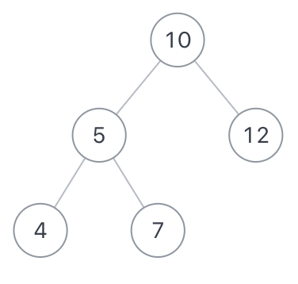

# JZ34 二叉树中和为某一值的路径（二）

## 描述

输入一颗二叉树的根节点$root$和一个整数$expectNumber$，找出二叉树中结点值的和为$expectNumber$的所有路径。

<!--more-->  

1.该题路径定义为从树的根结点开始往下一直到叶子结点所经过的结点   

2.叶子节点是指没有子节点的节点   

3.路径只能从父节点到子节点，不能从子节点到父节点   

4.总节点数目为n      

如二叉树$root$为{10,5,12,4,7},$expectNumber$为22 



 则合法路径有$[[10,5,7],[10,12]]$
 数据范围: 

 树中节点总数在范围 $[0, 5000]$ 内  

- $-1000 <= 节点值 <= 1000$  

- $-1000 <= expectNumber <= 1000$

**示例1**

```
输入：{10,5,12,4,7},22
返回值：[[10,5,7],[10,12]]
说明：返回[[10,12],[10,5,7]]也是对的      
```

**示例2**

```
输入：{10,5,12,4,7},15
返回值：[]
```

**示例3**

```
输入：{2,3},0
返回值：[]
```

**示例4**

```
输入：{1,3,4},7
返回值：[]
```

## 题解

初见思路：我在递归和栈之间思考了一下，第一直觉是递归在返回值的方面不好写，第二是我又想到可以把当前的$val$直接$push\_back$到上一层的返回结果里然后再返回。还是先用递归试一试吧。

后面思考了一下，因为返回值是二维数组，还是用栈来写，可以有一个全局的二维数组随时可以$push$进去。

**代码**

```C++
/**
 * struct TreeNode {
 *  int val;
 *  struct TreeNode *left;
 *  struct TreeNode *right;
 *  TreeNode(int x) : val(x), left(nullptr), right(nullptr) {}
 * };
 */
#include <stack>
#include <vector>
class Solution {
  public:
    /**
     * 代码中的类名、方法名、参数名已经指定，请勿修改，直接返回方法规定的值即可
     *
     *
     * @param root TreeNode类
     * @param target int整型
     * @return int整型vector<vector<>>
     */
    vector<vector<int> > FindPath(TreeNode* root, int target) {
        vector<vector<int>> ans;
        if (!root) return ans;

        stack<TreeNode*> nodeSt;
        stack<vector<int>> pathSt;
        stack<int> targetSt;

        nodeSt.push(root);
        pathSt.push({root->val});
        targetSt.push(target);

        while (!nodeSt.empty()) {
            TreeNode* curr = nodeSt.top();
            nodeSt.pop();
            vector<int> currPath = pathSt.top();
            pathSt.pop();
            int currTarget = targetSt.top();
            targetSt.pop();

            if (!curr->left && !curr->right && (currTarget - curr->val) == 0) {
                ans.push_back(currPath);
            }

            if (curr->left) {
                nodeSt.push(curr->left);
                vector<int> leftPath = currPath;
                leftPath.push_back(curr->left->val);
                pathSt.push(leftPath);
                targetSt.push(currTarget - curr->val);
            }

            if (curr->right) {
                nodeSt.push(curr->right);
                vector<int> rightPath = currPath;
                rightPath.push_back(curr->right->val);
                pathSt.push(rightPath);
                targetSt.push(currTarget - curr->val);
            }
        }

        return ans;

    }
};