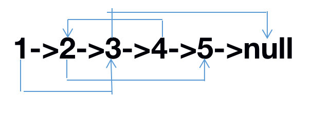

# JZ35 复杂链表的复制

## 描述

输入一个复杂链表（每个节点中有节点值，以及两个指针，一个指向下一个节点，另一个特殊指针random指向一个随机节点），请对此链表进行深拷贝，并返回拷贝后的头结点。（注意，输出结果中请不要返回参数中的节点引用，否则判题程序会直接返回空）。 下图是一个含有5个结点的复杂链表。图中实线箭头表示next指针，虚线箭头表示random指针。为简单起见，指向null的指针没有画出。


  示例: 

  输入:{1,2,3,4,5,3,5,#,2,#} 

  输出:{1,2,3,4,5,3,5,#,2,#} 

  解析:我们将链表分为两段，前半部分{1,2,3,4,5}为$ListNode$，后半部分{3,5,#,2,#}是随机指针域表示。 

  以上示例前半部分可以表示链表为的$ListNode:1->2->3->4->5$ 

  后半部分，3，5，#，2，#分别的表示为 

  1的位置指向3，2的位置指向5，3的位置指向null，4的位置指向2，5的位置指向null 

  如下图: 



**示例**

```
输入：{1,2,3,4,5,3,5,#,2,#}
返回值：{1,2,3,4,5,3,5,#,2,#}
```

## 题解

首先是要确定怎么深拷贝，$new$一个新的即可，声明一个新指针并对其赋值的方法是浅拷贝。

第一种思路是先沿着中心路径，拷贝一个新的链表，然后再将其$random$指针给复刻好就行，但是实现起来有些麻烦，还要使用哈希表做对应关系。

第二种方法是把每一个节点都拷贝一个在其后面，即$A->A‘->B->B'.......$，这样的话，在拷贝完成后，遍历原链表（每次跳一个访问即可访问原链表），令$A->next->random = A->random->next$即可复原$random$关系，最后将两个链表拆开即可。

- 拷贝链表时注意保持链表的连接关系
- 使用$A->next->random = A->random->next$时要注意判断$A->random$是否为空，否则$A->random$为空时，$A->random->next$会出错

**代码**

```C++
/*
struct RandomListNode {
    int label;
    struct RandomListNode *next, *random;
    RandomListNode(int x) :
            label(x), next(NULL), random(NULL) {
    }
};
*/
class Solution {
  public:
    RandomListNode* Clone(RandomListNode* pHead) {
        if(!pHead){
            return nullptr;
        }
        RandomListNode* head = pHead;
        while (head) {
            RandomListNode* copy = new RandomListNode(head->label);
            copy->next = head->next;
            head->next = copy;
            head = copy->next;
        }
        head = pHead;
        while (head) {
            if (head->random) {
                head->next->random = head->random->next;
            }
            head = head->next->next;
        }
        RandomListNode* newHead = pHead->next;
        RandomListNode* cur = pHead;

        while (cur) {
            RandomListNode* copy = cur->next;
            cur->next = copy->next;              // 恢复原链表
            if (copy->next) 
                copy->next = copy->next->next; // 连接新链表
            cur = cur->next;
        }

        return newHead;

    }
};
```

