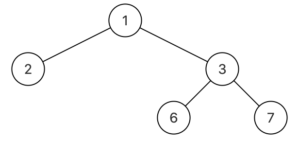
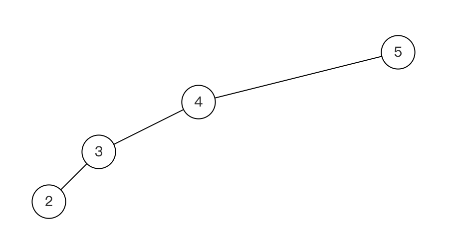

# JZ37 序列化二叉树

## 描述

<!--more-->

二叉树的序列化(Serialize)是指：把一棵二叉树按照某种遍历方式的结果以某种格式保存为字符串，从而使得内存中建立起来的二叉树可以持久保存。序列化可以基于先序、中序、后序、层序的二叉树等遍历方式来进行修改，序列化的结果是一个字符串，序列化时通过 某种符号表示空节点（#）

二叉树的反序列化(Deserialize)是指：根据某种遍历顺序得到的序列化字符串结果str，重构二叉树。 

例如，可以根据层序遍历的方案序列化，如下图: 



层序序列化(即用函数Serialize转化)如上的二叉树转为"{1,2,3,#,#,6,7}"，再能够调用反序列化(Deserialize)将"{1,2,3,#,#,6,7}"构造成如上的二叉树。 再举一个例子



层序序列化(即用函数Serialize转化)如上的二叉树转为"{5,4,#,3,#,2}"，再能够调用反序列化(Deserialize)将"{5,4,#,3,#,2}构造成如上的二叉树。

当然你也可以根据满二叉树结点位置的标号规律来序列化，还可以根据先序遍历和中序遍历的结果来序列化。不对序列化之后的字符串进行约束，所以欢迎各种奇思妙想。

数据范围：节点数$n≤100$，树上每个节点的值满足 $0≤val≤150$ 

要求：序列化和反序列化都是空间复杂度 $O(n)$，时间复杂度 $O(n)$ 

**示例1**

```
输入：{1,2,3,#,#,6,7}
返回值：{1,2,3,#,#,6,7}
说明：如题面图   
```

**示例2**

```
输入：{8,6,10,5,7,9,11}
返回值：{8,6,10,5,7,9,11}
```

## 题解

初见思路：有一个一定能成的思路就是序列化的话就输出一个中序序列一个前序序列，二者中间使用#分割，在反序列化的时候把这两个序列还原出来，然后再还原树就可以了。

C++的字符串处理还是一如既往的大分，然后其实只需要一个前序序列就可以了，把空白位置以#代替，这样就可以唯一地序列化一个树了，但是当树严重偏向右侧的时候(左子树为空，右子树很深的情况)，序列化结果可读性较低。问问大G老师有没有别的做法。

看了一下，大G老师给出的主要也就是两类做法，一类是使用单独的一个遍历序列，但是要把空结点用特殊记号表示；第二类是用两个序列，这样就不用特殊记号来表示了。

```c++
/*
struct TreeNode {
    int val;
    struct TreeNode *left;
    struct TreeNode *right;
    TreeNode(int x) :
            val(x), left(NULL), right(NULL) {
    }
};
*/
class Solution {
  public:
    char* Serialize(TreeNode* root) {
        if (!root) return nullptr;

        stringstream ss;
        serializeHelper(root, ss);
        string serializedStr = ss.str();

        // 将序列化的字符串转换为 C 风格字符串
        char* result = new char[serializedStr.size() + 1];
        strcpy(result, serializedStr.c_str());
        return result;
    }

    TreeNode* Deserialize(char* str) {
        if (!str) return nullptr;

        stringstream ss(str);
        return deserializeHelper(ss);
    }

  private:
    // 辅助函数：用于序列化，采用前序遍历
    void serializeHelper(TreeNode* root, stringstream& ss) {
        if (!root) {
            ss << "#" << " "; // 用 # 表示空节点
            return;
        }
        ss << root->val << " ";  // 序列化节点值
        serializeHelper(root->left, ss);  // 序列化左子树
        serializeHelper(root->right, ss); // 序列化右子树
    }

    // 辅助函数：用于反序列化，构建二叉树
    TreeNode* deserializeHelper(stringstream& ss) {
        string val;
        ss >> val;

        if (val == "#") return nullptr;  // 如果是空节点，返回 nullptr

        TreeNode* node = new TreeNode(stoi(val));  // 创建节点
        node->left = deserializeHelper(ss);  // 递归构建左子树
        node->right = deserializeHelper(ss); // 递归构建右子树

        return node;
    }
};
```

