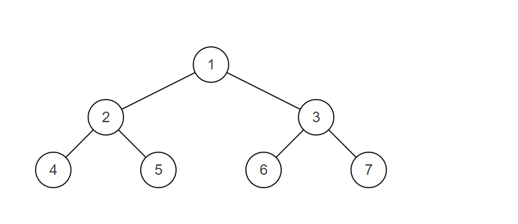

# JZ79 判断是不是平衡二叉树

## 描述

输入一棵节点数为 n 二叉树，判断该二叉树是否是平衡二叉树。 在这里，我们只需要考虑其平衡性，不需要考虑其是不是排序二叉树 

<!--more-->

**平衡二叉树**（Balanced Binary Tree），具有以下性质：它是一棵空树或它的左右两个子树的高度差的绝对值不超过1，并且左右两个子树都是一棵平衡二叉树。

样例解释： 

  

样例二叉树如图，为一颗平衡二叉树

注：我们约定空树是平衡二叉树。  

数据范围：n≤100n≤100,树上节点的val值满足 0≤n≤10000≤n≤1000  

要求：空间复杂度O(1)O(1)，时间复杂度 O(n)O(n)  

**输入描述：**输入一棵二叉树的根节点

**返回值描述：**输出一个布尔类型的值

**示例1**

```
输入：{1,2,3,4,5,6,7}
返回值：true
```

**示例2**

```
输入：{}
返回值：true
```

## 题解

初见思路：递归，直到递归到无子树即可。

还要考虑子树高度差。

**代码**

```C++
/**
 * struct TreeNode {
 *  int val;
 *  struct TreeNode *left;
 *  struct TreeNode *right;
 *  TreeNode(int x) : val(x), left(nullptr), right(nullptr) {}
 * };
 */
class Solution {
  public:
    /**
     * 代码中的类名、方法名、参数名已经指定，请勿修改，直接返回方法规定的值即可
     *
     *
     * @param pRoot TreeNode类
     * @return bool布尔型
     */
    bool IsBalanced_Solution(TreeNode* pRoot) {
        return checkBalance(pRoot)!=-1;
    }

  private:
    // 计算树的高度并检查平衡性
    int checkBalance(TreeNode* root) {
        if (root == nullptr) return 0;  // 空树的高度是0

        // 递归计算左右子树的高度
        int leftHeight = checkBalance(root->left);
        int rightHeight = checkBalance(root->right);

        // 如果左子树或右子树不平衡，或者高度差超过1，返回-1
        if (leftHeight == -1 || rightHeight == -1 || abs(leftHeight - rightHeight) > 1)
            return -1;

        // 返回当前树的高度
        return std::max(leftHeight, rightHeight) + 1;
    }
};
```

