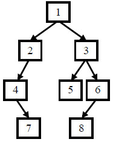

# JZ7 重建二叉树

## 描述

给定节点数为 n 的二叉树的前序遍历和中序遍历结果，请重建出该二叉树并返回它的头结点。  

<!--more-->

例如输入前序遍历序列{1,2,4,7,3,5,6,8}和中序遍历序列{4,7,2,1,5,3,8,6}，则重建出如下图所示。 



提示: 

- vin.length == pre.length  

- pre 和 vin 均无重复元素  

- vin出现的元素均出现在 pre里  

- 只需要返回根结点，系统会自动输出整颗树做答案对比  

数据范围：$n≤2000$，节点的值 $−10000≤val≤10000$  

要求：空间复杂度 $O(n)$，时间复杂度 $O(n)$  

**示例1**

```
输入：[1,2,4,7,3,5,6,8],[4,7,2,1,5,3,8,6]
返回值：{1,2,3,4,#,5,6,#,7,#,#,8}
说明：返回根节点，系统会输出整颗二叉树对比结果，重建结果如题面图示    
```

**示例2**

```
输入：[1],[1]
返回值：{1}
```

**示例3**

```
输入：[1,2,3,4,5,6,7],[3,2,4,1,6,5,7]
返回值：{1,2,5,3,4,6,7}
```

## 题解

初见题解：又是一道死去的记忆，用前序序列和中序序列恢复出二叉树，~~二者都是DFS，如果实现它们的话应该是使用堆来实现，那么反向的话应该也是如此。~~

~~回想起来了，~~前序序列的第一个一定是根，然后可以利用根去划分中序序列中属于左子树和右子树的部分，然后递归就可以了。

**代码**

```C++
/**
 * struct TreeNode {
 *  int val;
 *  struct TreeNode *left;
 *  struct TreeNode *right;
 *  TreeNode(int x) : val(x), left(nullptr), right(nullptr) {}
 * };
 */
#include <queue>
#include <vector>
class Solution {
  public:
    /**
     * 代码中的类名、方法名、参数名已经指定，请勿修改，直接返回方法规定的值即可
     *
     *
     * @param preOrder int整型vector
     * @param vinOrder int整型vector
     * @return TreeNode类
     */
    TreeNode* reConstructBinaryTree(vector<int>& preOrder, vector<int>& vinOrder) {
        if (preOrder.size() == 0) return nullptr;

        TreeNode* pRoot = new TreeNode(preOrder[0]);

        vector<int> leftVinOrder;
        int root = 0;
        for (; root < vinOrder.size(); root++) {
            if (preOrder[0] == vinOrder[root]) {
                break;
            }
            leftVinOrder.push_back(vinOrder[root]);
        }

        vector<int> rightVinOrder;
        for (int i = root + 1; i < vinOrder.size(); i++) {
            rightVinOrder.push_back(vinOrder[i]);
        }

        vector<int> leftPreOrder;
        int Count = 0;
        for (int i = 0; i < preOrder.size(); i++) {
            if (find(leftVinOrder.begin(), leftVinOrder.end(),
                     preOrder[i]) != leftVinOrder.end()) {
                leftPreOrder.push_back(preOrder[i]);
                Count++;
            }
        }

        vector<int> rightPreOrder;
        Count = 0;
        for (int i = 0; i < preOrder.size(); i++) {
            if (find(rightVinOrder.begin(), rightVinOrder.end(),
                     preOrder[i]) != rightVinOrder.end()) {
                rightPreOrder.push_back(preOrder[i]);
                Count++;
            }
        }


        pRoot->left = reConstructBinaryTree(leftPreOrder, leftVinOrder);
        pRoot->right = reConstructBinaryTree(rightPreOrder, rightVinOrder);

        return pRoot;
    }
};
```

**gpt优化代码**

没有仔细看，效率确实高了很多，但是感觉可读性会差一些。

```C++
class Solution {
public:
    TreeNode* reConstructBinaryTree(vector<int>& preOrder, vector<int>& vinOrder) {
        return build(preOrder, 0, preOrder.size()-1, vinOrder, 0, vinOrder.size()-1);
    }

    TreeNode* build(const vector<int>& pre, int preL, int preR,
                    const vector<int>& vin, int vinL, int vinR) {
        if (preL > preR || vinL > vinR) return nullptr;

        // 根节点是前序遍历的第一个
        TreeNode* root = new TreeNode(pre[preL]);

        // 在中序里找到根的位置
        int k = vinL;
        while (k <= vinR && vin[k] != pre[preL]) k++;

        int leftSize = k - vinL;

        // 构造左子树
        root->left = build(pre, preL+1, preL+leftSize, vin, vinL, k-1);
        // 构造右子树
        root->right = build(pre, preL+leftSize+1, preR, vin, k+1, vinR);

        return root;
    }
};

```

