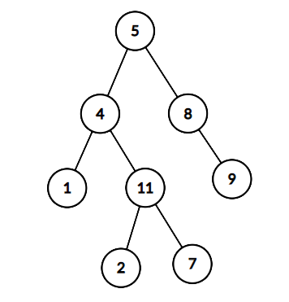

# JZ82 二叉树中和为某一值的路径（一）

## 描述

给定一个二叉树root和一个值 sum ，判断是否有从根节点到叶子节点的节点值之和等于 sum 的路径。

<!--more-->  

- 该题路径定义为从树的根结点开始往下一直到叶子结点所经过的结点   
- 叶子节点是指没有子节点的节点   
- 路径只能从父节点到子节点，不能从子节点到父节点   
- 总节点数目为n   

例如：
给出如下的二叉树， sum=22,



返回true，因为存在一条路径 $5\rightarrow 4\rightarrow 11\rightarrow 25\rightarrow 4\rightarrow 11\rightarrow 2$的节点值之和为 22 

数据范围： 

- 树上的节点数满足 $0≤n≤10000$  

- 每个节点的值都满足 $∣val∣≤1000$

要求：空间复杂度 $O(n)$，时间复杂度 $O(n)$  

进阶：空间复杂度 $O(树的高度)$，时间复杂度 $O(n)$

**示例1**

```
输入：{5,4,8,1,11,#,9,#,#,2,7},22
返回值：true
```

**示例2**

```
输入：{1,2},0
返回值：false
```

**示例3**

```
输入：{1,2},3
返回值：true
```

**示例4**

```
输入：{},0
返回值：false
```

## 题解

初见思路：今晚第六道题本来以为做个简单下班了，结果做昏头了，没注意到要求从根到**叶子**节点，用两个队列层序遍历磨磨叽叽半天做出来一看不对，直接用栈、递归做$BFS$就行了，烂。

```C++
/**
 * struct TreeNode {
 *	int val;
 *	struct TreeNode *left;
 *	struct TreeNode *right;
 *	TreeNode(int x) : val(x), left(nullptr), right(nullptr) {}
 * };
 */
class Solution {
public:
    bool hasPathSum(TreeNode* root, int sum) {
        if (!root) return false;  // 如果当前节点为空，返回 false

        // 检查是否到达叶子节点并且路径和是否等于 sum
        if (!root->left && !root->right) {
            return root->val == sum;  // 只有在叶子节点才与 sum 比较
        }

        // 递归到左右子树，减去当前节点的值
        int newSum = sum - root->val;
        return hasPathSum(root->left, newSum) || hasPathSum(root->right, newSum);
    }
};

```

