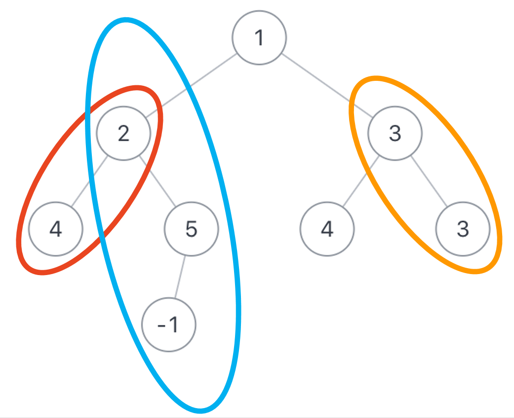

# JZ84 二叉树中和为某一值的路径（三）

## 描述

给定一个二叉树root和一个整数值 sum ，求该树有多少路径的的节点值之和等于 sum 。 

<!--more-->

1.该题路径定义不需要从根节点开始，也不需要在叶子节点结束，但是一定是从父亲节点往下到孩子节点  

2.总节点数目为n   

3.保证最后返回的路径个数在整形范围内(即路径个数小于231-1)    

数据范围:  $0<=n<=1000$  $−109<=节点值<=109$

假如二叉树$root$为{1,2,3,4,5,4,3,#,#,-1}，$sum=6$，那么总共如下所示，有3条路径符合要求  



**示例1**

```
输入：{1,2,3,4,5,4,3,#,#,-1},6
返回值：3
说明：如图所示，有3条路径符合      
```

**示例2**

```
输入：{0,1},1
返回值：2
```

**示例3**

```
输入：{1,#,2,#,3},3
返回值：2
```

## 题解

初见思路：这道题终归还是出到了（三），这一次比起前面的更难，只要顺序是从上到下，可以以任意节点为起点终点，好处是只需要统计符合条件的数量即可，目前的思路是对每一个结点进行一个递归，试一试吧。

在实际写的时候，考虑到其实只需要对每个结点追踪一个从前面每一个结点开始到现在减去路程上的值后还剩多少的一个$sum$值就可以了，这样就可以使用两个栈同步进行递归，把每一个结点的每一个路径都给找出来。~~（一遍过）~~

**代码**

```C++
/**
 * struct TreeNode {
 *	int val;
 *	struct TreeNode *left;
 *	struct TreeNode *right;
 *	TreeNode(int x) : val(x), left(nullptr), right(nullptr) {}
 * };
 */
#include <stack>
class Solution {
public:
    /**
     * 代码中的类名、方法名、参数名已经指定，请勿修改，直接返回方法规定的值即可
     *
     * 
     * @param root TreeNode类 
     * @param sum int整型 
     * @return int整型
     */
    int FindPath(TreeNode* root, int sum) {
        int ans = 0;

        if(!root) return ans;

        stack<TreeNode*> nodeSt;
        stack<vector<int>> sumSt;
        
        nodeSt.push(root);
        sumSt.push({sum});
        while (!nodeSt.empty()) {
            TreeNode* curr = nodeSt.top();
            nodeSt.pop();

            vector<int> sums = sumSt.top();
            sumSt.pop();
            for(int& i : sums){
                if(i-curr->val==0) ans++;
                i = i - curr->val;
            }

            sums.push_back(sum);

            if(curr->left) {nodeSt.push(curr->left);sumSt.push(sums);}
            if(curr->right) {nodeSt.push(curr->right);sumSt.push(sums);}
        }
        return ans;
    }
};
```