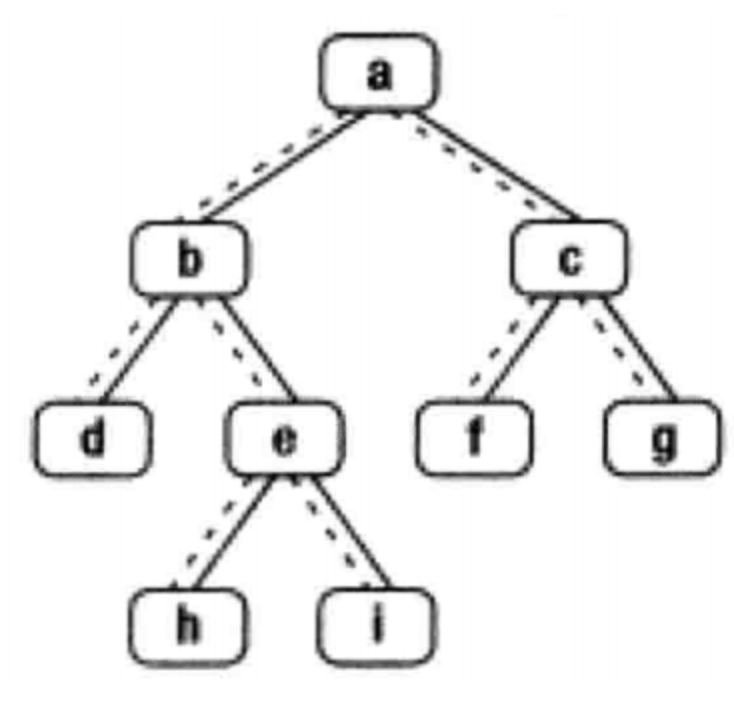
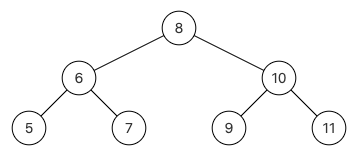

# JZ8 二叉树的下一个结点

## 描述

给定一个二叉树其中的一个结点，请找出中序遍历顺序的下一个结点并且返回。

<!--more-->

注意，树中的结点不仅包含左右子结点，同时包含指向父结点的next指针。下图为一棵有9个节点的二叉树。树中从父节点指向子节点的指针用实线表示，从子节点指向父节点的用虚线表



示例:   输入:{8,6,10,5,7,9,11},8 返回:9 

解析:这个组装传入的子树根节点，其实就是整颗树，中序遍历{5,6,7,8,9,10,11}，根节点8的下一个节点就是9，应该返回{9,10,11}，后台只打印子树的下一个节点，所以只会打印9，如下图，其实都有指向左右孩子的指针，还有指向父节点的指针，下图没有画出来 



数据范围：节点数满足 $1≤n≤50$，节点上的值满足 $1≤val≤100$ 

要求：空间复杂度 $O(1)$ ，时间复杂度 $O(n)$ 

**输入描述：**

输入分为2段，第一段是整体的二叉树，第二段是给定二叉树节点的值，后台会将这2个参数组装为一个二叉树局部的子树传入到函数$GetNext$里面，用户得到的输入只有一个子树根节点

**返回值描述：**

返回传入的子树根节点的下一个节点，后台会打印输出这个节点6

**示例1**

```
输入：{8,6,10,5,7,9,11},8
返回值：9
```

**示例2**

```
输入：{8,6,10,5,7,9,11},6
返回值：7
```

**示例3**

```
输入：{1,2,#,#,3,#,4},4
返回值：1
```

**示例4**

```
输入：{5},5
返回值："null"
说明：不存在，后台打印"null"  
```

## 题解

初见思路:要中序遍历的下一个结点,那就中序遍历就好了,给出的结点可能是中间的子结点,但是这道题的二叉树是双向的二叉树,可以一直找到树根,那么思路就可以变成先找根结点再中序遍历,找到原始的结点后再去找下一个结点返回就可以了.

手敲了一遍$DFS$,前面敲$BFS$比较多,这道题主要难点还是在与要去寻找树根,但是如果是双向树的话找树根再简单不过了,然后在$DFS$前面加一个$sameFlag$来检查是不是找到了相同结点就可以了.

**代码**

```C++
/*
struct TreeLinkNode {
    int val;
    struct TreeLinkNode *left;
    struct TreeLinkNode *right;
    struct TreeLinkNode *next;
    TreeLinkNode(int x) :val(x), left(NULL), right(NULL), next(NULL) {
        
    }
};
*/
#include <stack>
class Solution {
public:
    TreeLinkNode* GetNext(TreeLinkNode* pNode) {
        TreeLinkNode* root = pNode;
        while (root->next) {
            root = root->next;
        }

        bool sameFlag = false;

        stack<TreeLinkNode*> st;
        TreeLinkNode* curr = root;
        while (curr||!st.empty()) {
            while (curr) {
                st.push(curr);
                curr = curr->left;
            }

            curr = st.top();
            st.pop();

            cout << curr->val << endl;
            if(sameFlag) return curr;
            if(curr->val == pNode->val) sameFlag = true;

            curr = curr->right;
        }

        return nullptr;
    }
};

```

